# Sơ đồ UML — Hệ thống OPDFlow

Tài liệu này chứa các sơ đồ Use Case, Sequence và Activity cho các chức năng chính của hệ thống, gồm 2 thành phần:

1. **doctor_portal_project** — Web portal cho bác sĩ và admin (Django)
2. **IoT (kiosk QR scanner)** — Thiết bị quét mã QR check-in tại phòng khám

## Cách render sơ đồ

- **Online**: Copy nội dung khối `@startuml ... @enduml` vào https://www.plantuml.com/plantuml/
- **VS Code**: Cài extension "PlantUML" → mở file → Alt+D
- **CLI**: `plantuml diagram.puml`

---

## 1. SƠ ĐỒ USE CASE

### 1.1. Use Case tổng quan toàn hệ thống

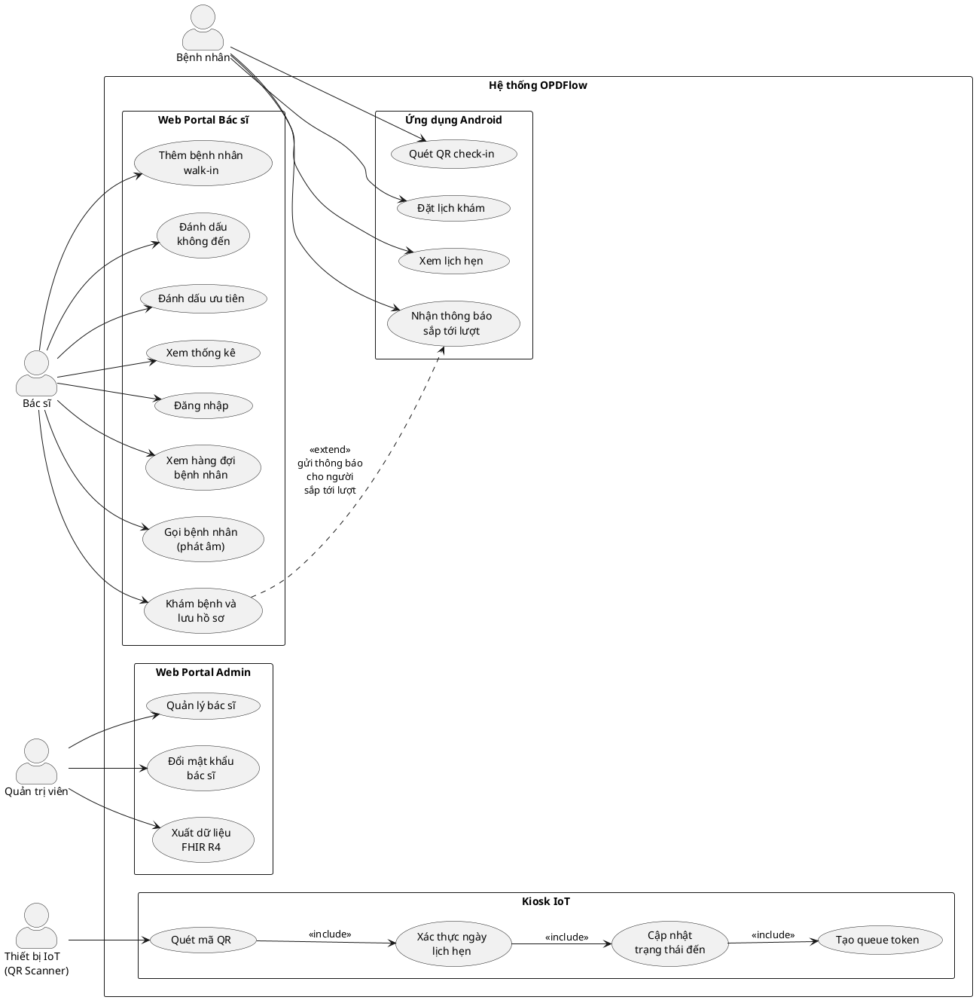

### 1.2. Use Case của Bác sĩ

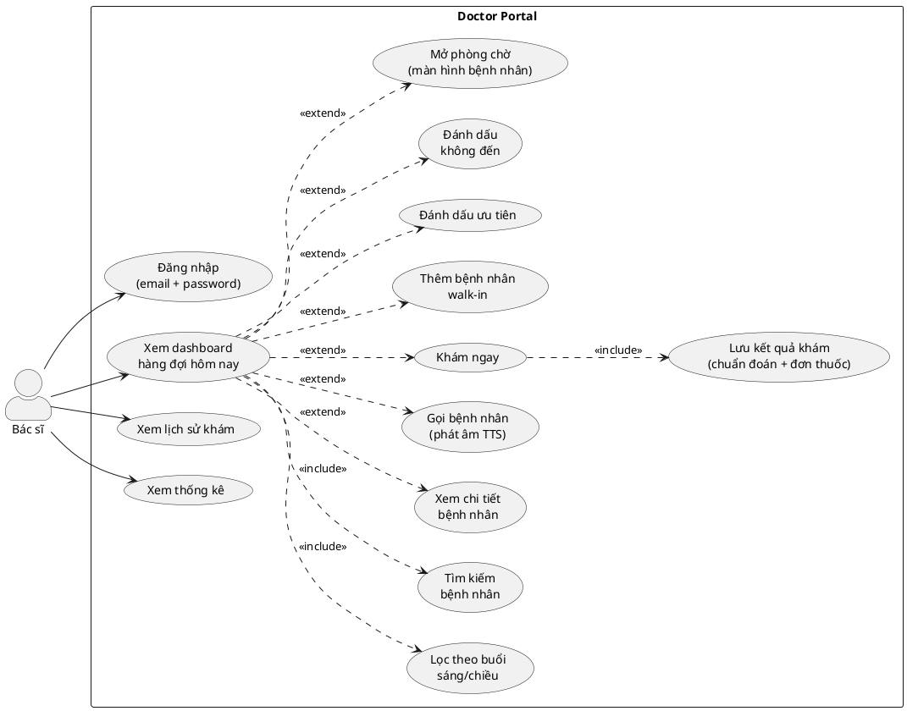

### 1.3. Use Case của Quản trị viên

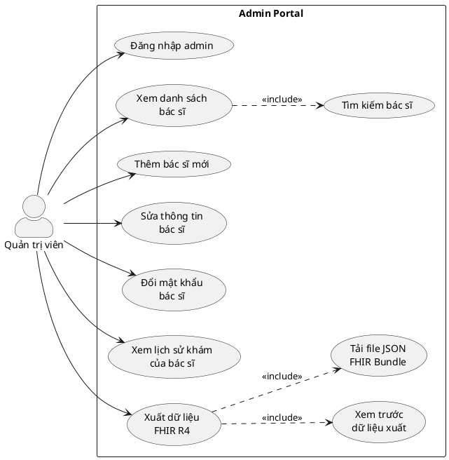

### 1.4. Use Case của Thiết bị IoT

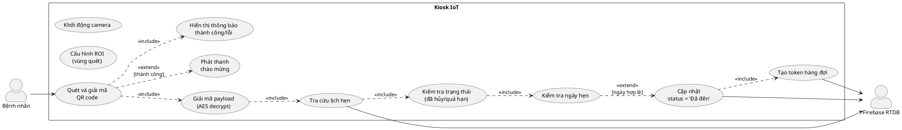

---

## 2. SƠ ĐỒ SEQUENCE

### 2.1. Bác sĩ đăng nhập

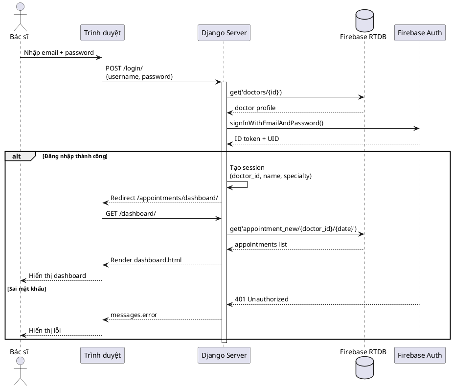

### 2.2. Bệnh nhân check-in qua thiết bị IoT

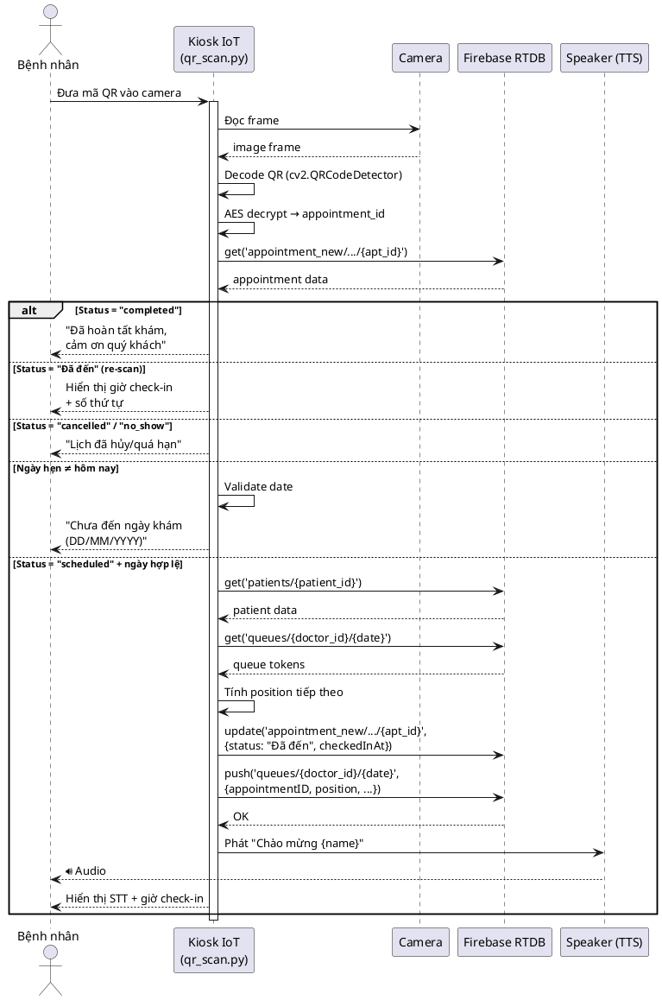

### 2.3. Bác sĩ gọi bệnh nhân và khám bệnh

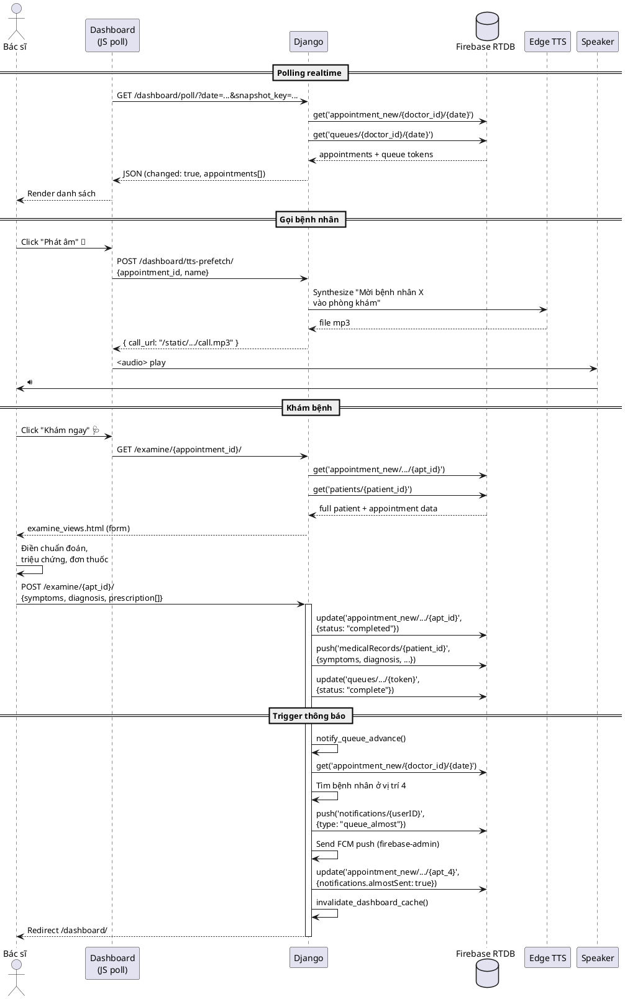

### 2.4. Thông báo "Sắp tới lượt" tới App Android

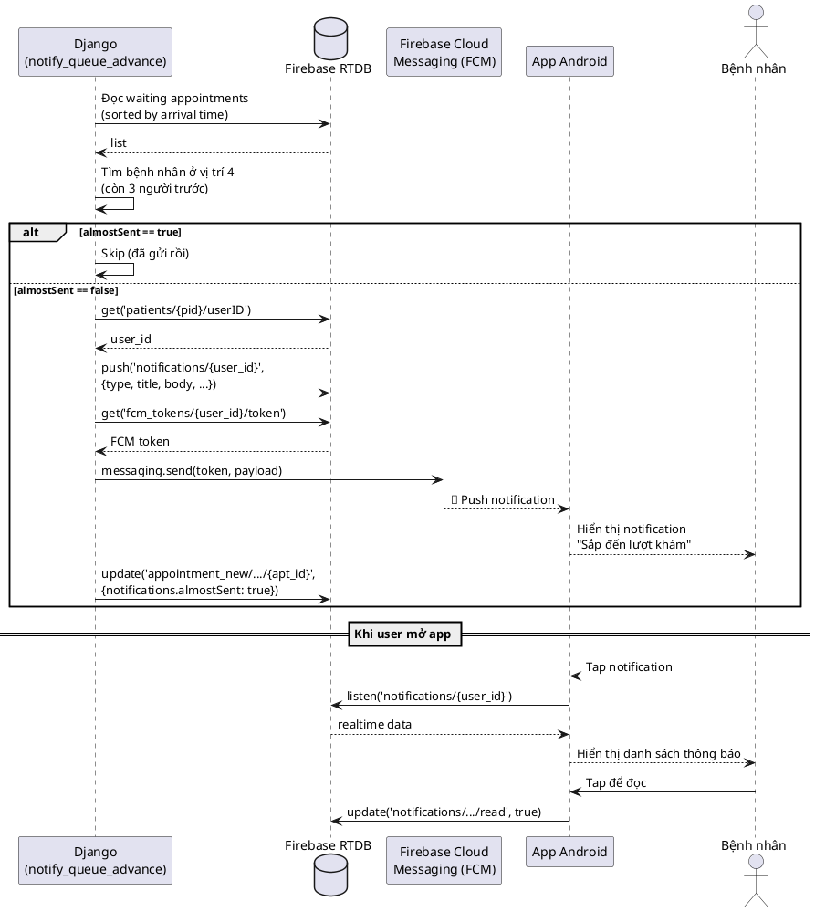

### 2.5. Bác sĩ thêm bệnh nhân walk-in

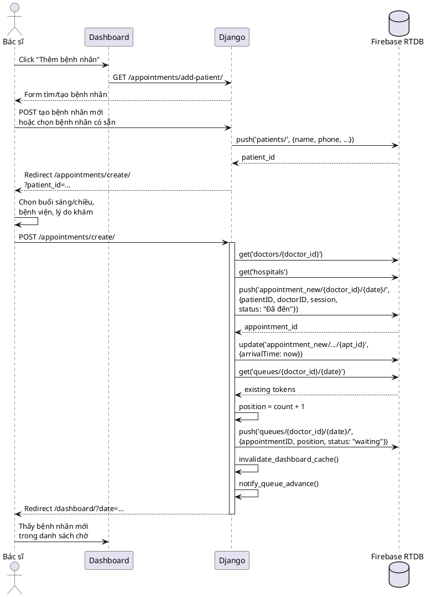

### 2.6. Admin xuất dữ liệu FHIR R4

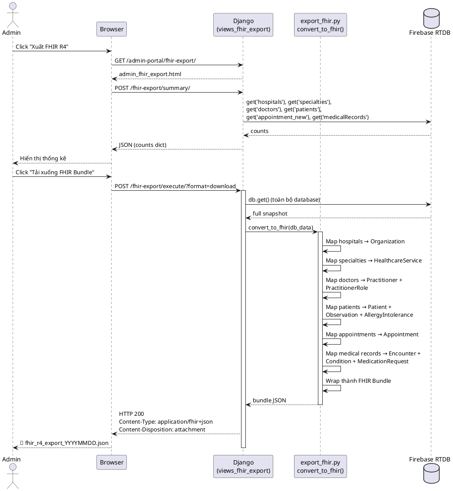

---

## 3. SƠ ĐỒ ACTIVITY

### 3.1. Luồng đặt lịch + check-in + khám bệnh tổng quát

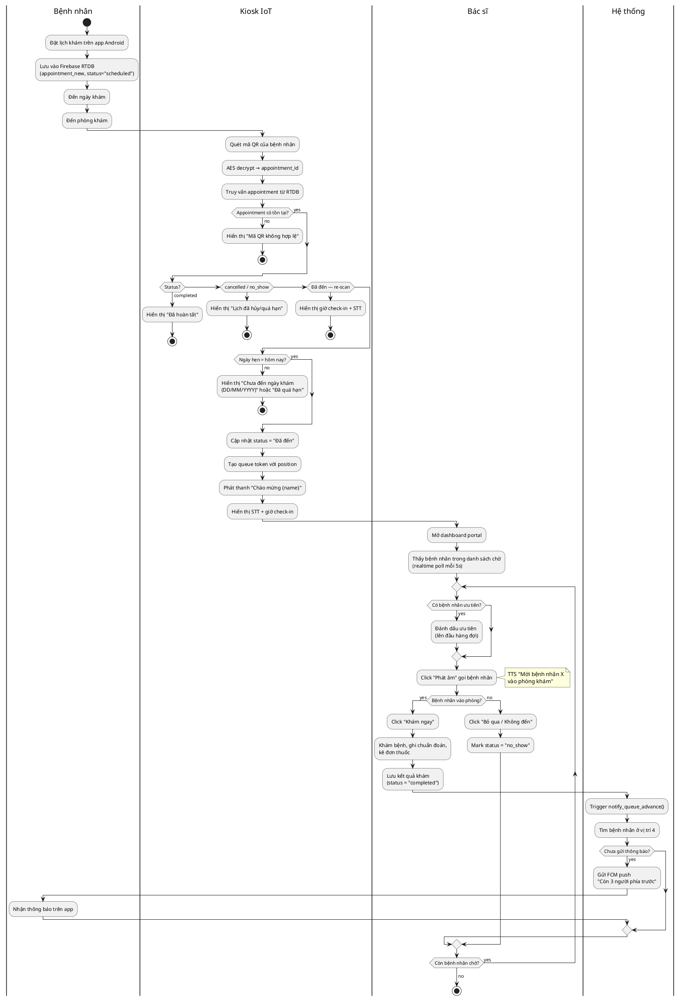

### 3.2. Luồng kiểm tra ngày check-in tại Kiosk IoT

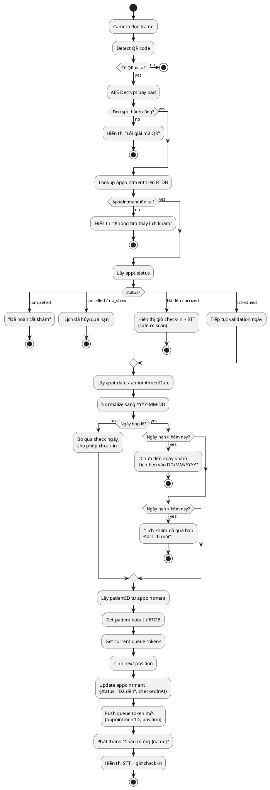

### 3.3. Luồng tự động đánh dấu no-show

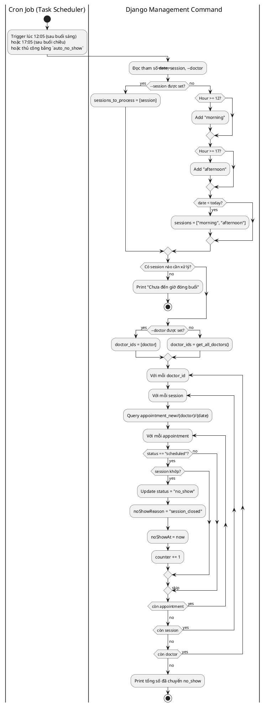

### 3.4. Luồng admin tạo bác sĩ mới

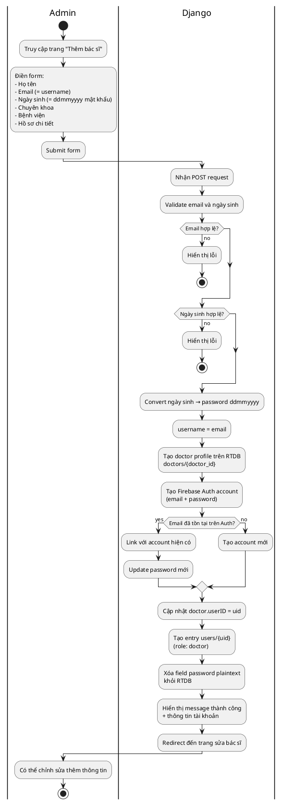

### 3.5. Luồng polling realtime của Dashboard

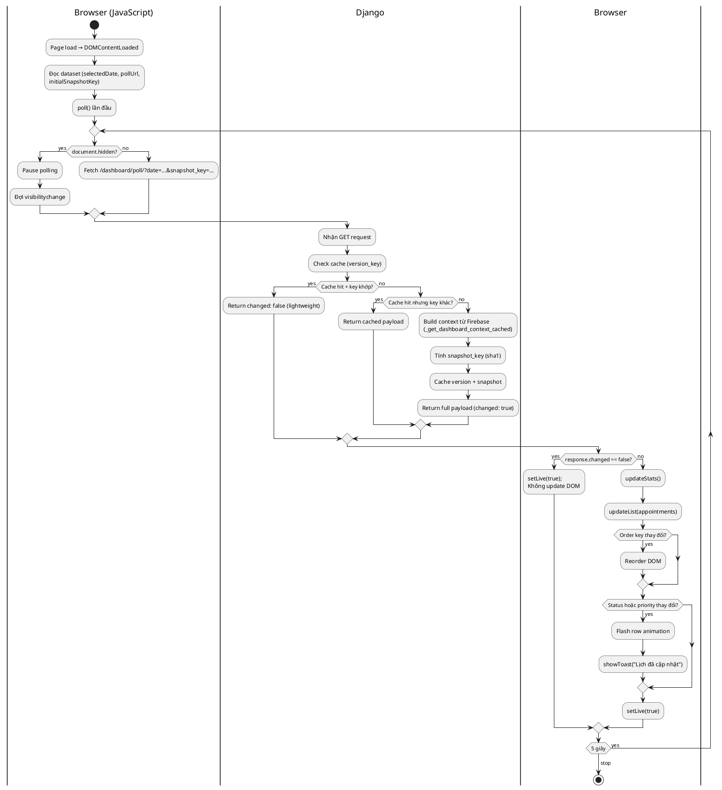

---

## 4. CÁCH RENDER SƠ ĐỒ

### 4.1. Online (nhanh nhất)

1. Truy cập https://www.plantuml.com/plantuml/uml
2. Copy nội dung từ `@startuml` đến `@enduml`
3. Paste vào textarea → enter
4. Right-click ảnh → Save image as PNG/SVG

### 4.2. VS Code

1. Cài extension **"PlantUML"** (jebbs.plantuml)
2. Tạo file `.puml` với nội dung
3. Alt+D để preview
4. File → Export Current Diagram → chọn PNG/SVG

### 4.3. CLI

```bash
# Cài plantuml (cần Java)
# Tải: https://plantuml.com/download

# Render
java -jar plantuml.jar diagram.puml
# Sinh ra diagram.png
```

### 4.4. Docker

```bash
docker run -v $(pwd):/data plantuml/plantuml -tpng *.puml
```

---

## 5. GỢI Ý CHO BÁO CÁO

**Thứ tự đề xuất chèn vào báo cáo:**

| Chương | Sơ đồ |
|--------|-------|
| Phân tích yêu cầu | Use Case tổng quan (1.1) |
| Đặc tả chức năng | Use Case từng actor (1.2-1.4) |
| Thiết kế chi tiết — Bác sĩ | Sequence 2.1, 2.3, 2.5 + Activity 3.1, 3.5 |
| Thiết kế chi tiết — IoT | Sequence 2.2 + Activity 3.2 |
| Thiết kế chi tiết — Notification | Sequence 2.4 |
| Thiết kế chi tiết — Admin | Sequence 2.6 + Activity 3.4 |
| Thiết kế chi tiết — Background | Activity 3.3 (auto no-show) |

**Style tip:**
- Đặt mỗi sơ đồ trong 1 figure riêng, đánh số (Hình 4.1, 4.2, ...)
- Mỗi sơ đồ kèm 1-2 dòng caption mô tả
- Render PNG với `dpi=300` cho in ấn rõ nét
